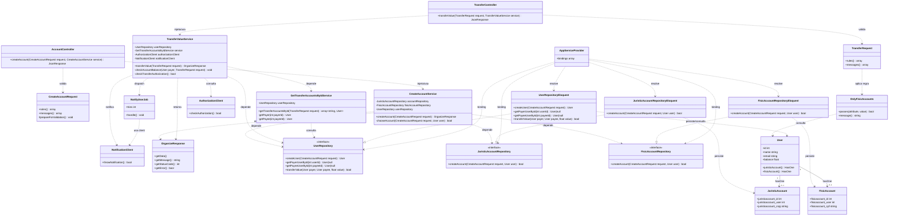

# Diagrama de classes - rotinas de AccountController e TransferController

```mermaid
classDiagram
    direction TB

    class AccountController {
        +createAccount(CreateAccountRequest request, CreateAccountService service) JsonResponse
    }

    class TransferController {
        +transferValue(TransferRequest request, TransferValueService service) JsonResponse
    }

    class CreateAccountRequest {
        +rules() array
        +messages() array
        #prepareForValidation() void
    }

    class TransferRequest {
        +rules() array
        +messages() array
    }

    class OnlyFisicAccounts {
        +passes(attribute, value) bool
        +message() string
    }

    class CreateAccountService {
        -JuristicAccountRepository accountRepository
        -FisicAccountRepository fisicAccountRepository
        -UserRepository userRepository
        +createAccount(CreateAccountRequest request) OrganizeResponse
        -chooseAccount(CreateAccountRequest request, User user) bool
    }

    class TransferValueService {
        -UserRepository userRepository
        -GetTransferAccountsByIdService service
        -AuthorizationClient authorizationClient
        -NotificationClient notificationClient
        +transferValue(TransferRequest request) OrganizeResponse
        -checkAccountBalance(User payer, TransferRequest request) void
        -checkTransferAuthorization() bool
    }

    class GetTransferAccountsByIdService {
        -UserRepository userRepository
        +getTransferAccountsById(TransferRequest request) array~string, User~
        -getPayer(int payerId) User
        -getPayee(int payeeId) User
    }

    class AuthorizationClient {
        +checkAuthorization() bool
    }

    class NotificationClient {
        +throwNotification() bool
    }

    class NotifyUserJob {
        +tries int
        +handle() void
    }

    class OrganizeResponse {
        +getData()
        +getMessage() string
        +getStatusCode() int
        +getError() bool
    }

    class UserRepository {
        <<interface>>
        +createUser(CreateAccountRequest request) User
        +getPayerUserById(int userId) User|null
        +getPayeeUserById(int payeeId) User|null
        +transferValue(User payer, User payee, float value) bool
    }

    class JuristicAccountRepository {
        <<interface>>
        +createAccount(CreateAccountRequest request, User user) bool
    }

    class FisicAccountRepository {
        <<interface>>
        +createAccount(CreateAccountRequest request, User user) bool
    }

    class UserRepositoryEloquent {
        +createUser(CreateAccountRequest request) User
        +getPayerUserById(int userId) User|null
        +getPayeeUserById(int payeeId) User|null
        +transferValue(User payer, User payee, float value) bool
    }

    class JuristicAccountRepositoryEloquent {
        +createAccount(CreateAccountRequest request, User user) bool
    }

    class FisicAccountRepositoryEloquent {
        +createAccount(CreateAccountRequest request, User user) bool
    }

    class User {
        +id int
        +name string
        +email string
        +balance float
        +juristicAccount() HasOne
        +fisicAccount() HasOne
    }

    class JuristicAccount {
        +juristicaccount_id int
        +juristicaccount_user int
        +juristicaccount_cnpj string
    }

    class FisicAccount {
        +fisicaccount_id int
        +fisicaccount_user int
        +fisicaccount_cpf string
    }

    class AppServiceProvider {
        +bindings array
    }

    AccountController ..> CreateAccountRequest : valida
    AccountController ..> CreateAccountService : injeta/usa
    TransferController ..> TransferRequest : valida
    TransferController ..> TransferValueService : injeta/usa

    TransferRequest ..> OnlyFisicAccounts : aplica regra

    CreateAccountService ..> OrganizeResponse : retorna
    TransferValueService ..> OrganizeResponse : retorna

    CreateAccountService ..> UserRepository : depende
    CreateAccountService ..> JuristicAccountRepository : depende
    CreateAccountService ..> FisicAccountRepository : depende

    TransferValueService ..> UserRepository : depende
    TransferValueService ..> GetTransferAccountsByIdService : depende
    TransferValueService ..> AuthorizationClient : consulta
    TransferValueService ..> NotificationClient : notifica
    TransferValueService ..> NotifyUserJob : dispatch

    GetTransferAccountsByIdService ..> UserRepository : consulta
    OnlyFisicAccounts ..> User : consulta

    UserRepositoryEloquent ..|> UserRepository
    JuristicAccountRepositoryEloquent ..|> JuristicAccountRepository
    FisicAccountRepositoryEloquent ..|> FisicAccountRepository

    UserRepositoryEloquent ..> User : persiste/consulta
    JuristicAccountRepositoryEloquent ..> JuristicAccount : persiste
    FisicAccountRepositoryEloquent ..> FisicAccount : persiste

    User "1" --> "0..1" JuristicAccount : hasOne
    User "1" --> "0..1" FisicAccount : hasOne

    NotifyUserJob ..> NotificationClient : usa client

    AppServiceProvider ..> UserRepository : binding
    AppServiceProvider ..> UserRepositoryEloquent : resolve
    AppServiceProvider ..> JuristicAccountRepository : binding
    AppServiceProvider ..> JuristicAccountRepositoryEloquent : resolve
    AppServiceProvider ..> FisicAccountRepository : binding
    AppServiceProvider ..> FisicAccountRepositoryEloquent : resolve
```

