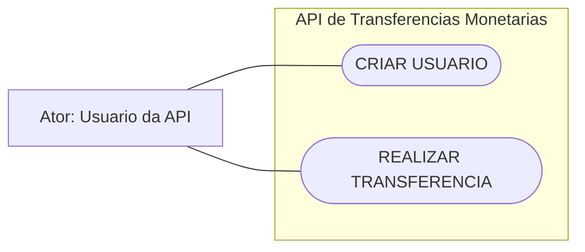

# Diagrama de casos de uso (Mermaid)

```mermaid
flowchart LR
    actor["Ator: Usuario da API"]

    subgraph system["API de Transferencias Monetarias"]
        uc1([CRIAR USUARIO])
        uc2([REALIZAR TRANSFERENCIA])
    end

    actor --- uc1
    actor --- uc2
```

